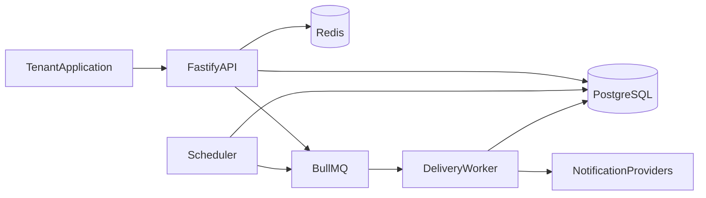
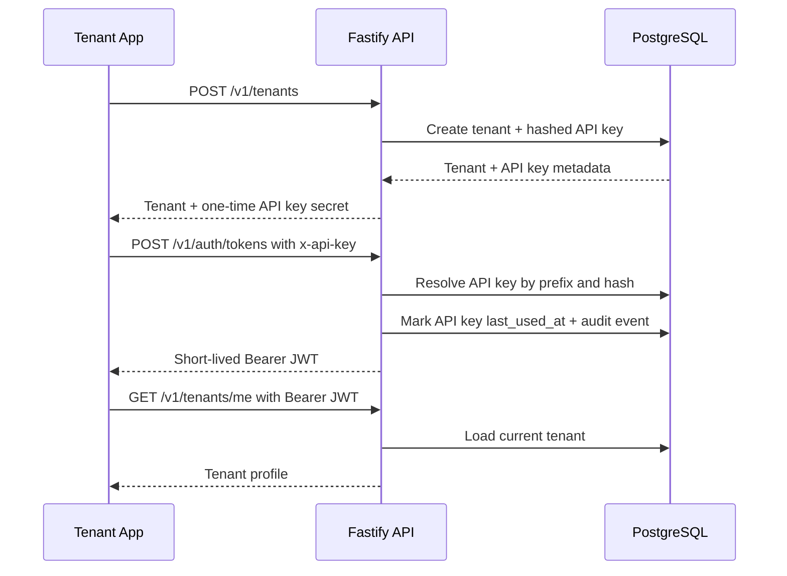
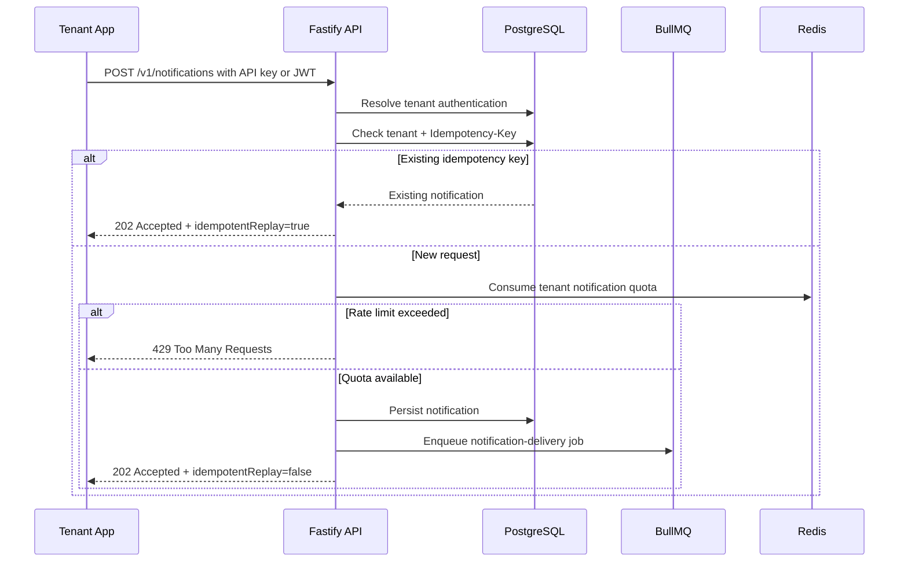
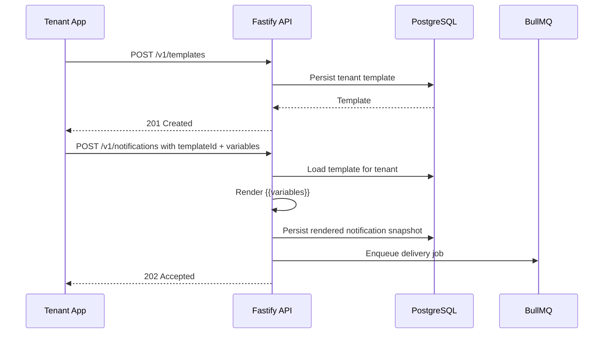
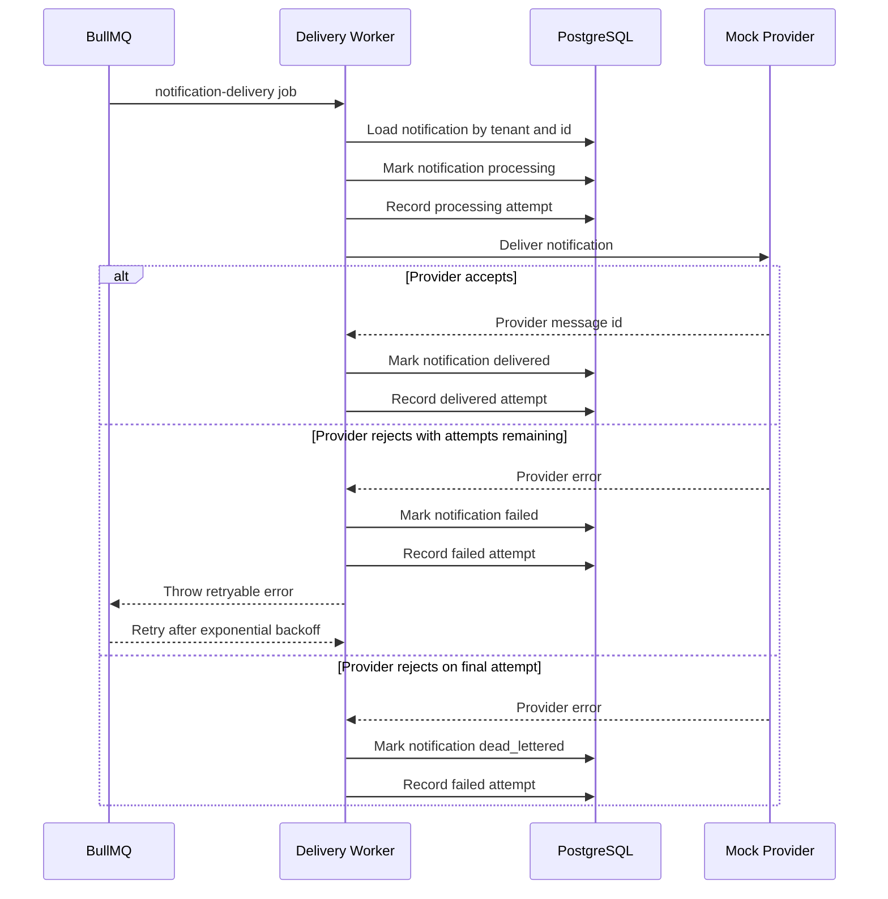

# NotifyHub Architecture

NotifyHub starts as a modular monolith with three runtime entrypoints: API, worker, and scheduler. This keeps local development and deployment approachable while enforcing boundaries that can be extracted into separate services later.

## Runtime Topology

## Boundary Rules

- Domain code does not depend on HTTP, queues, databases, or framework adapters.
- Application use cases coordinate domain behavior and transaction boundaries.
- Infrastructure adapters implement repositories, providers, queue publishers, and external clients.
- Interfaces expose HTTP routes and translate transport concerns into application commands.

## Implemented Foundation

The first implementation phase establishes the runtime foundation:

- Strict TypeScript configuration.
- Fastify API composition.
- Structured logging.
- Environment validation.
- Health checks for liveness and readiness.
- Docker Compose for PostgreSQL and Redis.
- CI quality gates.

The second phase adds the identity foundation:

- PostgreSQL migration runner with append-only SQL migrations.
- Tenants with status and per-minute rate limit configuration.
- One-time API key issuance with hashed storage.
- API-key authentication through `x-api-key` or `Authorization: ApiKey ...`.
- Short-lived JWT issuance for tenant-scoped API access.
- Authenticated request context for downstream modules.
- Audit log persistence for identity events.

The third phase adds notification intake:

- Tenant-authenticated `POST /v1/notifications`.
- Email, SMS, push, and webhook channel modeling.
- Durable notification persistence with tenant-scoped idempotency keys.
- Immediate and scheduled notification state.
- BullMQ enqueueing with a stable `notification-delivery` job payload.

The fourth phase adds delivery processing:

- BullMQ worker consumption for `notification-delivery` jobs.
- Provider abstraction by channel.
- Mock email, SMS, push, and webhook providers.
- Notification state transitions from queued/scheduled to processing, delivered, or failed.
- Append-only delivery attempt history with provider metadata and errors.

The fifth phase adds retry and dead-letter behavior:

- Environment-driven delivery max attempts and exponential backoff.
- BullMQ retries for retryable provider failures.
- Durable failed state between attempts.
- Final exhausted failures transition notifications to `dead_lettered`.
- Last provider error metadata is stored on the notification record.

The sixth phase adds notification templates:

- Tenant-authenticated `POST /v1/templates`.
- Channel-specific subject/body templates.
- `{{variable}}` placeholder rendering during notification intake.
- Missing variable validation before enqueueing.
- Notifications persist rendered subject/body snapshots plus the source template id.

The seventh phase adds tenant rate limiting:

- Tenant `rate_limit_per_minute` policy is enforced during notification intake.
- Redis fixed-window counters track accepted notification commands per tenant.
- Idempotent notification replays return the existing notification without consuming quota.
- Exceeded limits return `429 NOTIFICATION_RATE_LIMIT_EXCEEDED` before persistence or enqueueing.

The eighth phase adds notification status and analytics reads:

- Tenant-authenticated `GET /v1/notifications`.
- Pagination with `limit` and `offset`.
- Filtering by notification `status` and `channel`.
- Tenant notification metrics grouped by status and channel.
- Delivery attempt totals for delivered and failed provider attempts.

Additional analytics dimensions and dashboard-oriented projections can be implemented after this read foundation is stable.

## Identity Flow

## Notification Intake Flow

## Template Rendering Flow

## Delivery Worker Flow

