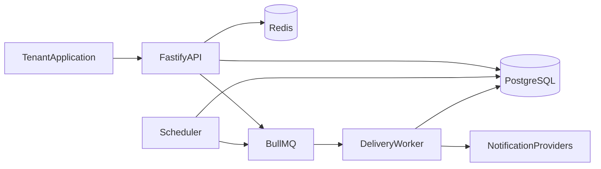
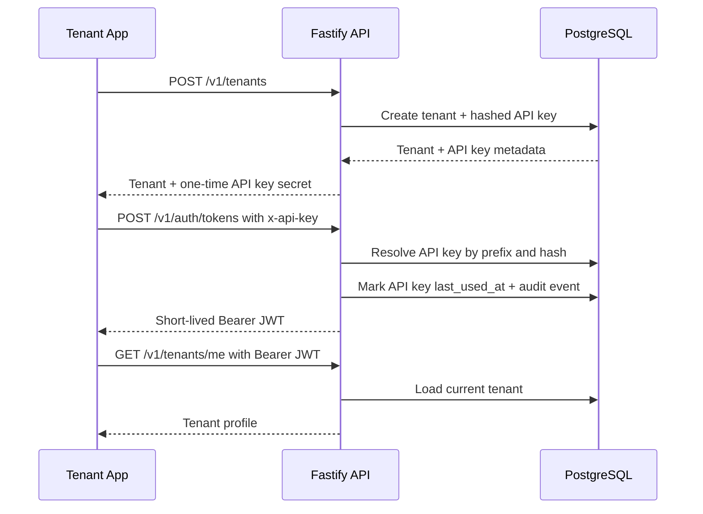
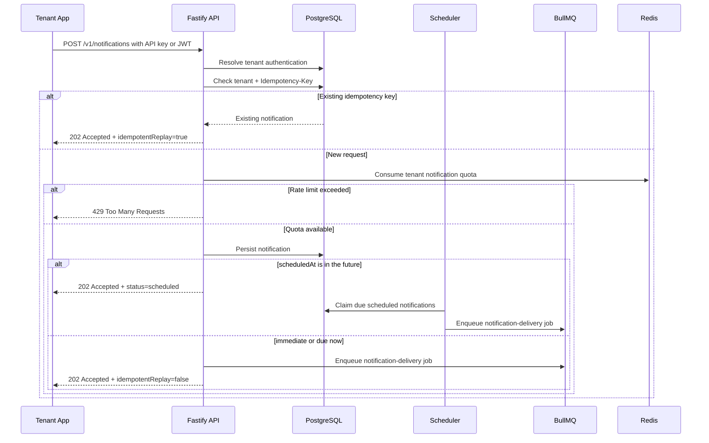
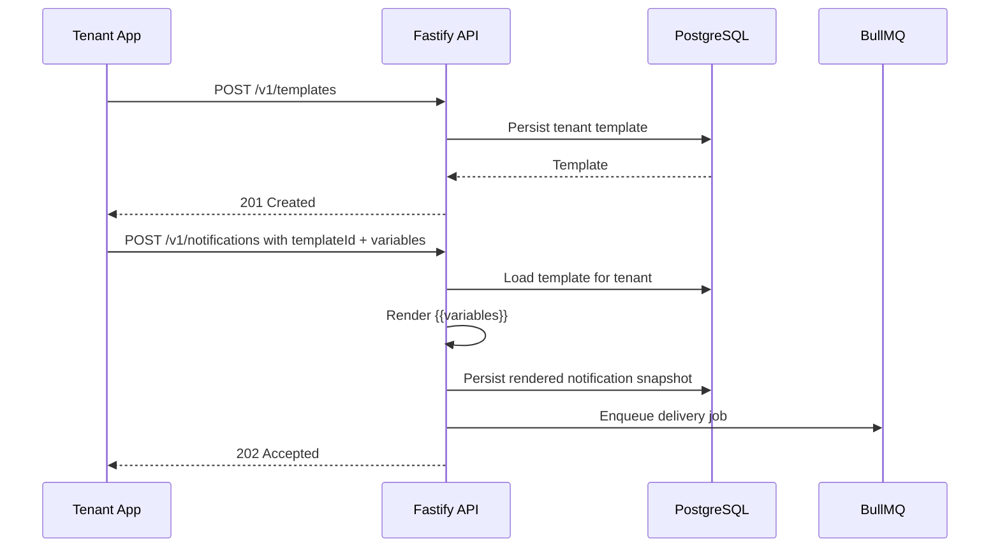
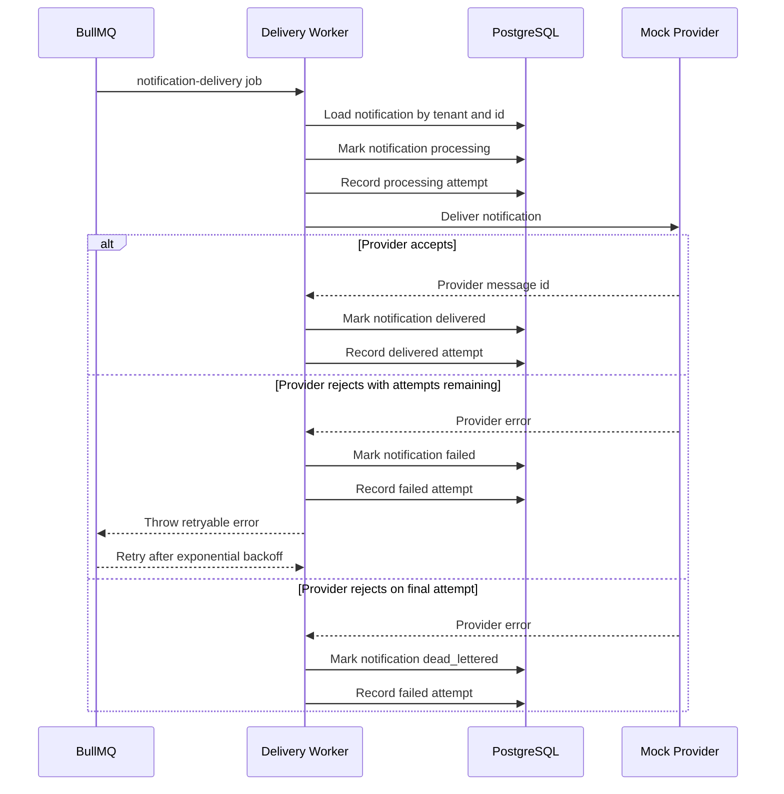

# NotifyHub Architecture

NotifyHub starts as a modular monolith with three runtime entrypoints: API, worker, and scheduler. This keeps local development and deployment approachable while enforcing boundaries that can be extracted into separate services later.

## Runtime Topology

## Boundary Rules

- Domain code does not depend on HTTP, queues, databases, or framework adapters.
- Application use cases coordinate domain behavior and transaction boundaries.
- Infrastructure adapters implement repositories, providers, queue publishers, and external clients.
- Interfaces expose HTTP routes and translate transport concerns into application commands.

## System Capabilities

NotifyHub is organized around durable notification intake, asynchronous delivery, and tenant-scoped operational visibility.

### Runtime And Infrastructure

- Strict TypeScript configuration with Fastify API composition.
- PostgreSQL migration runner with append-only SQL migrations.
- PostgreSQL persistence for tenants, credentials, templates, notifications, delivery attempts, and audit logs.
- Redis-backed rate limiting and BullMQ job orchestration.
- Structured logging, environment validation, health checks, Docker Compose, and CI quality gates.

### Identity And Tenant Isolation

- Tenants have status and per-minute notification rate-limit configuration.
- API keys are issued once and stored only as hashed credentials.
- Tenant APIs support `x-api-key`, `Authorization: ApiKey ...`, and short-lived Bearer JWT authentication.
- Authenticated request context carries tenant and actor information into downstream use cases.
- Audit logs capture identity events and are readable only within the authenticated tenant scope.

### Notification Lifecycle

- Tenants submit notifications through `POST /v1/notifications`.
- Supported channels are email, SMS, push, and webhook.
- Idempotency keys prevent duplicate notification creation for retried client requests.
- Future scheduled notifications remain durable in PostgreSQL until the scheduler promotes them.
- Due and immediate notifications are published to the BullMQ `notification-delivery` queue.
- The delivery worker records processing, delivered, failed, and dead-letter outcomes.
- Retry behavior uses environment-driven max attempts and exponential backoff.
- Exhausted delivery failures transition notifications to `dead_lettered`.

### Templates And Rendering

- Tenants create channel-specific templates through `POST /v1/templates`.
- Templates support `{{variable}}` placeholders for subject and body rendering.
- Missing variables are rejected before persistence or queueing.
- Accepted notifications store rendered subject/body snapshots and retain the source template id.

### Reads And Analytics

- `GET /v1/notifications` lists tenant notifications with pagination and filters.
- `GET /v1/notifications/:notificationId/delivery-attempts` exposes provider attempt history for a tenant-owned notification.
- `GET /v1/analytics/notifications` returns tenant notification totals grouped by status, channel, and delivery attempt outcome.
- `GET /v1/audit-logs` returns tenant-scoped audit history with pagination and filters.

### Operations

- `GET /v1/queues/notification-delivery/metrics` exposes BullMQ job counts for delivery queue monitoring.
- `GET /v1/dlq/notifications` lists tenant dead-lettered notifications with pagination and channel filtering.
- `POST /v1/dlq/notifications/:notificationId/replay` moves a dead-lettered notification back to `queued` and publishes a fresh delivery job.

## Identity Flow

## Notification Intake Flow

## Template Rendering Flow

## Delivery Worker Flow

