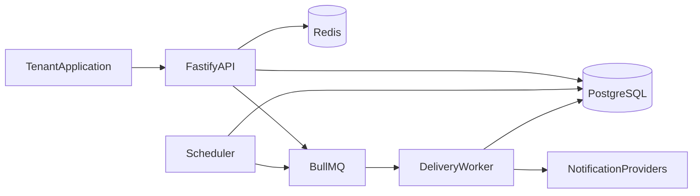
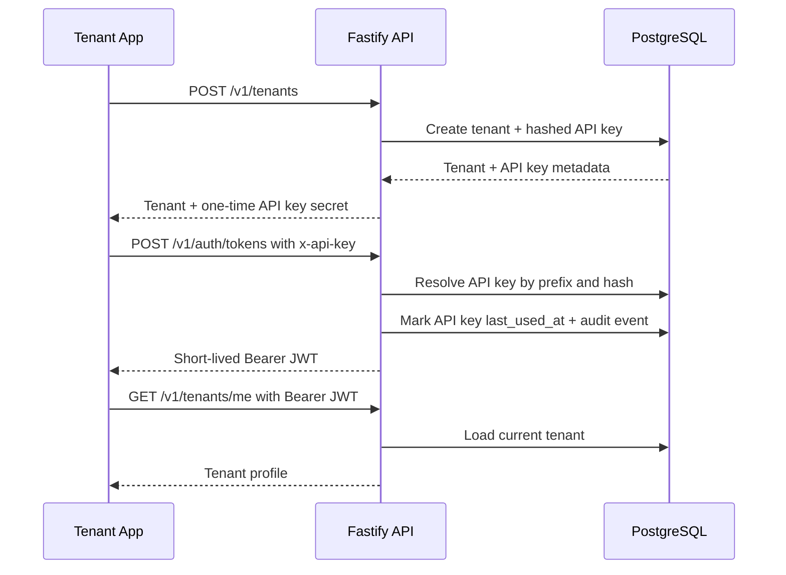

# NotifyHub Architecture

NotifyHub starts as a modular monolith with three runtime entrypoints: API, worker, and scheduler. This keeps local development and deployment approachable while enforcing boundaries that can be extracted into separate services later.

## Runtime Topology

## Boundary Rules

- Domain code does not depend on HTTP, queues, databases, or framework adapters.
- Application use cases coordinate domain behavior and transaction boundaries.
- Infrastructure adapters implement repositories, providers, queue publishers, and external clients.
- Interfaces expose HTTP routes and translate transport concerns into application commands.

## Implemented Foundation

The first implementation phase establishes the runtime foundation:

- Strict TypeScript configuration.
- Fastify API composition.
- Structured logging.
- Environment validation.
- Health checks for liveness and readiness.
- Docker Compose for PostgreSQL and Redis.
- CI quality gates.

The second phase adds the identity foundation:

- PostgreSQL migration runner with append-only SQL migrations.
- Tenants with status and per-minute rate limit configuration.
- One-time API key issuance with hashed storage.
- API-key authentication through `x-api-key` or `Authorization: ApiKey ...`.
- Short-lived JWT issuance for tenant-scoped API access.
- Authenticated request context for downstream modules.
- Audit log persistence for identity events.

Notification, queue, delivery, templates, rate limiting, and analytics modules will be implemented incrementally after this identity foundation is stable.

## Identity Flow

